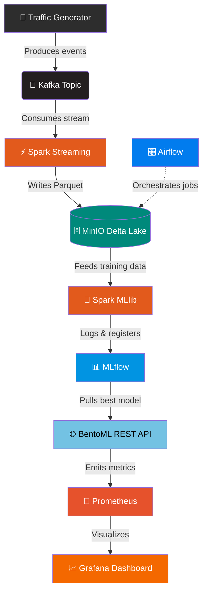

<div align="center">

<br/>

```
███╗   ██╗███████╗████████╗    ████████╗██╗  ██╗██████╗ ███████╗ █████╗ ████████╗
████╗  ██║██╔════╝╚══██╔══╝    ╚══██╔══╝██║  ██║██╔══██╗██╔════╝██╔══██╗╚══██╔══╝
██╔██╗ ██║█████╗     ██║          ██║   ███████║██████╔╝█████╗  ███████║   ██║   
██║╚██╗██║██╔══╝     ██║          ██║   ██╔══██║██╔══██╗██╔══╝  ██╔══██║   ██║   
██║ ╚████║███████╗   ██║          ██║   ██║  ██║██║  ██║███████╗██║  ██║   ██║   
╚═╝  ╚═══╝╚══════╝   ╚═╝          ╚═╝   ╚═╝  ╚═╝╚═╝  ╚═╝╚══════╝╚═╝  ╚═╝   ╚═╝   
```

# 🛡️ Real-Time Network Threat Detection

### *An end-to-end Big Data & ML pipeline that detects malicious network traffic — live.*

<br/>

[](https://www.docker.com/)
[](https://kafka.apache.org/)
[](https://spark.apache.org/)
[](https://mlflow.org/)
[](https://bentoml.com/)
[](https://airflow.apache.org/)
[](https://grafana.com/)
[](https://prometheus.io/)

<br/>

> 💡 **Engineering Highlight:** This entire microservices architecture runs locally within a strict **5 GB RAM constraint** — demonstrating advanced container resource management and lightweight orchestration at scale.

<br/>

</div>

---

## 📖 Table of Contents

- [Architecture Overview](#-architecture-overview)
- [Data Flow](#-data-flow)
- [Prerequisites](#-prerequisites)
- [Quick Start](#-quick-start)
- [End-to-End Execution Guide](#️-end-to-end-execution-guide)
- [Port Reference](#-port-mapping-reference)
- [Clean Up](#-clean-up)

---

## 🏗️ Architecture Overview

This project implements a **complete Big Data lifecycle** across **8 distinct layers**, from raw traffic ingestion all the way to real-time monitoring.

<br/>

| # | Layer | Technology | Role |
|---|-------|------------|------|
| 1️⃣ | **Ingestion** | Apache Kafka | Real-time network log generation |
| 2️⃣ | **Storage** | MinIO (S3-compatible) | Delta Lake / Lakehouse architecture |
| 3️⃣ | **Processing** | Spark Structured Streaming | Real-time data transformation |
| 4️⃣ | **Orchestration** | Apache Airflow | Automated pipeline scheduling |
| 5️⃣ | **Machine Learning** | Spark MLlib | Random Forest threat classification |
| 6️⃣ | **Tracking** | MLflow | Experiment tracking & model versioning |
| 7️⃣ | **Serving** | BentoML | Containerized REST API deployment |
| 8️⃣ | **Monitoring** | Prometheus + Grafana | Real-time system & inference tracking |

---

## 🔄 Data Flow



---

## ⚙️ Prerequisites

Before running this pipeline locally, ensure you have the following:

- 🐳 **Docker & Docker Compose** — installed and running
- 💾 **≥ 5 GB RAM** — allocated to your Docker engine (or WSL2 backend)
- 🔧 **Git** — to clone the repository

---

## 🚀 Quick Start

### 1. Clone the Repository

```bash
git clone https://github.com/Munusam/NETWORK-THREAT.git
cd NETWORK-THREAT
```

### 2. Launch the Infrastructure

Start all core services — Kafka, MinIO, MLflow, Spark, Airflow, BentoML, Prometheus, and Grafana — in detached mode:

```bash
docker-compose up -d
```

> ⏳ **Allow ~60 seconds** for services like Airflow and BentoML to fully initialize before proceeding.

---

## 🗺️ End-to-End Execution Guide

Work through these steps to push data through every layer of the pipeline:

---

### 🟢 Step 1 — Start the Kafka Generator *(Layer 1)*

Generate a continuous stream of simulated benign and malicious network traffic:

```bash
python generator.py
```

---

### 🟡 Step 2 — Stream Data to the Lake *(Layers 2 & 3)*

1. Open **JupyterLab** → [http://localhost:8888](http://localhost:8888)
2. Open the `01_data_ingestion.ipynb` notebook.
3. Run all cells to launch Spark Structured Streaming — this consumes the Kafka stream and writes Parquet files into the **MinIO Lakehouse** ([http://localhost:9001](http://localhost:9001)).

---

### 🔵 Step 3 — Train & Track the Model *(Layers 5 & 6)*

1. Open `02_model_training.ipynb` in JupyterLab.
2. Run all cells to train the **Random Forest classifier** on the Delta Lake data.
3. Visit **MLflow UI** → [http://localhost:5050](http://localhost:5050) to inspect F1 scores, run metrics, and registered model versions.
4. *(Optional)* Copy the `Run ID` of your best model to update the BentoML container when deploying a new version.

---

### 🟣 Step 4 — Serve the Model *(Layer 7)*

The BentoML API starts automatically. To test it:

1. Navigate to **Swagger UI** → [http://localhost:3030](http://localhost:3030)
2. Open the `POST /predict` endpoint → click **Try it out** → send a payload:

```json
{
  "source_port": 12345,
  "dest_port": 80,
  "bytes": 14000
}
```

3. Receive an instant classification:

```json
{ "is_attack": 1 }   // ⚠️  Malicious traffic detected
{ "is_attack": 0 }   // ✅  Benign traffic
```

---

### 🟠 Step 5 — Monitor the API *(Layer 8)*

1. Open **Grafana** → [http://localhost:3050](http://localhost:3050)  
   *(Login: `admin` / `admin`)*
2. View the custom dashboard tracking:

| Metric | PromQL Query |
|--------|--------------|
| **Total API Requests** | `sum(bentoml_service_request_duration_seconds_count)` |
| **Model Inference Speed** | `sum(bentoml_service_request_duration_seconds_sum)` |
| **Active Traffic** | `sum(bentoml_service_request_in_progress)` |

---

### 🔴 Step 6 — Orchestrate Background Jobs *(Layer 4)*

1. Open **Apache Airflow** → [http://localhost:8080](http://localhost:8080)  
   *(Login: `admin` / `admin`)*
2. Unpause and manually trigger the `network_threat_orchestration` DAG.
3. Watch the automated tasks run **Model Drift Monitoring** and **Cold Data Archiving**.

---

## 🌐 Port Mapping Reference

| Service | UI Endpoint | Credentials |
|---------|-------------|-------------|
| 🪐 **JupyterLab** | [http://localhost:8888](http://localhost:8888) | *(Token in logs)* |
| 🗄️ **MinIO Console** | [http://localhost:9001](http://localhost:9001) | `admin` / `password` |
| 📊 **MLflow** | [http://localhost:5050](http://localhost:5050) | *(None)* |
| 🌐 **BentoML Swagger** | [http://localhost:3030](http://localhost:3030) | *(None)* |
| 🎛️ **Apache Airflow** | [http://localhost:8080](http://localhost:8080) | `admin` / `admin` |
| 📈 **Grafana** | [http://localhost:3050](http://localhost:3050) | `admin` / `admin` |
| 📡 **Prometheus** | [http://localhost:9090](http://localhost:9090) | *(None)* |

---

## 🧹 Clean Up

To stop and remove all containers, networks, and volumes:

```bash
docker-compose down -v
```

> ⚠️ **Warning:** This deletes all persisted data, including your trained models and Delta Lake files. Back up anything important before running this command.

---

<div align="center">

**Built with ❤️ and a 5 GB RAM budget.**

*If this project was useful, consider leaving a ⭐ on the repo!*

</div>
