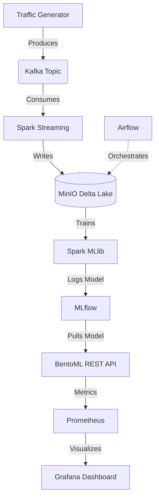

<div align="center">

# 🛡️ Real-Time Network Threat Detection Architecture


**An end-to-end, 8-layer Big Data and Machine Learning pipeline designed to ingest, process, and classify malicious network traffic in real-time.**

</div>

<br/>

> **💡 Engineering Highlight:** This entire microservices architecture was heavily optimized to run locally within a strict **5GB RAM constraint**, demonstrating advanced container resource management and lightweight orchestration techniques.

---

## 🏗️ Architecture Overview

This project implements a complete Big Data lifecycle divided into 8 distinct layers:

1. **Ingestion:** Real-time network log generation via **Apache Kafka**.
2. **Storage:** Delta Lake / Lakehouse architecture using **MinIO** (S3-compatible).
3. **Processing:** Real-time data transformations using **Spark Structured Streaming**.
4. **Orchestration:** Automated pipeline scheduling (data archiving & drift monitoring) via a lightweight **Apache Airflow** setup.
5. **Machine Learning:** Threat classification using a Random Forest model built with **Spark MLlib**.
6. **Tracking:** Experiment tracking, parameter logging, and model versioning via **MLflow**.
7. **Serving:** Containerized REST API model deployment using **BentoML**.
8. **Monitoring:** Real-time system and inference tracking using **Prometheus** & **Grafana**.

<br/>


```markdown

## 🔄 Data Flow



---

## ⚙️ Prerequisites

To run this pipeline locally, you will need:

* **Docker & Docker Compose** installed and running.
* At least **5GB of RAM** allocated to your Docker engine (or WSL2 backend).
* **Git** to clone the repository.

---

## 🚀 Quick Start Guide

### 1. Clone the Repository

```bash
git clone [https://github.com/Munusam/NETWORK-THREAT.git](https://github.com/Munusam/NETWORK-THREAT.git)
cd NETWORK-THREAT

```

### 2. Launch the Infrastructure

Start the core services (Kafka, MinIO, MLflow, Spark, Airflow, BentoML, Prometheus, Grafana) in detached mode:

```bash
docker-compose up -d

```

> ⏳ **Note:** Wait ~60 seconds for all services, especially Airflow and BentoML, to fully initialize.

---

## 🗺️ End-to-End Execution Guide

Follow these steps to push data through the entire pipeline:

### Step 1: Start the Kafka Generator (Layer 1)

Open a terminal and start the Python script to generate simulated benign and malicious network traffic:

```bash
python generator.py

```

### Step 2: Stream to the Data Lake (Layers 2 & 3)

1. Navigate to **JupyterLab**: http://localhost:8888
2. Open the `01_data_ingestion.ipynb` notebook.
3. Run the cells to start Spark Structured Streaming. This will consume the Kafka stream and write Parquet files into the MinIO Lakehouse (http://localhost:9001).

### Step 3: Train & Track the Model (Layers 5 & 6)

1. Open the `02_model_training.ipynb` notebook in JupyterLab.
2. Run the cells to train the Random Forest model on the stored Delta Lake data.
3. Navigate to the **MLflow UI** at http://localhost:5050 to view your F1 Scores, run metrics, and registered models.
4. *Optional:* Copy the `Run ID` of your best model to update the BentoML container if deploying a new version.

### Step 4: Serve the Model (Layer 7)

The BentoML API is automatically running and waiting for HTTP POST requests.

1. Navigate to the **Swagger UI**: http://localhost:3030
2. Open the `POST /predict` endpoint, click **Try it out**, and send a test JSON payload:

```json
{
  "source_port": 12345,
  "dest_port": 80,
  "bytes": 14000
}

```

3. Receive a real-time `{"is_attack": 1}` or `{"is_attack": 0}` classification.

### Step 5: Monitor the API (Layer 8)

1. Navigate to **Grafana**: http://localhost:3050
2. Login with `admin` / `admin`.
3. View the custom dashboard tracking:
* **Total API Requests**: `sum(bentoml_service_request_duration_seconds_count)`
* **Model Inference Speed**: `sum(bentoml_service_request_duration_seconds_sum)`
* **Active Traffic**: `sum(bentoml_service_request_in_progress)`


### Step 6: Orchestrate Background Jobs (Layer 4)

1. Navigate to **Apache Airflow**: http://localhost:8080 *(Login: `admin` / `admin`)*.
2. Unpause and manually trigger the `network_threat_orchestration` DAG.
3. Watch the automated tasks simulate Model Drift Monitoring and Cold Data Archiving.

---

## 🌐 Port Mapping Reference

| Service | UI Endpoint | Default Credentials |
| --- | --- | --- |
| **JupyterLab** | http://localhost:8888 | *(None / Token in logs)* |
| **MinIO Console** | http://localhost:9001 | `admin` / `password` |
| **MLflow** | http://localhost:5050 | *(None)* |
| **BentoML Swagger API** | http://localhost:3030 | *(None)* |
| **Apache Airflow** | http://localhost:8080 | `admin` / `admin` |
| **Grafana** | http://localhost:3050 | `admin` / `admin` |
| **Prometheus** | http://localhost:9090 | *(None)* |

---

## 🧹 Clean Up

To stop the cluster and remove the containers, networks, and volumes *(⚠️ Note: this will delete your data)*:

```bash
docker-compose down -v

```

```

```

```
